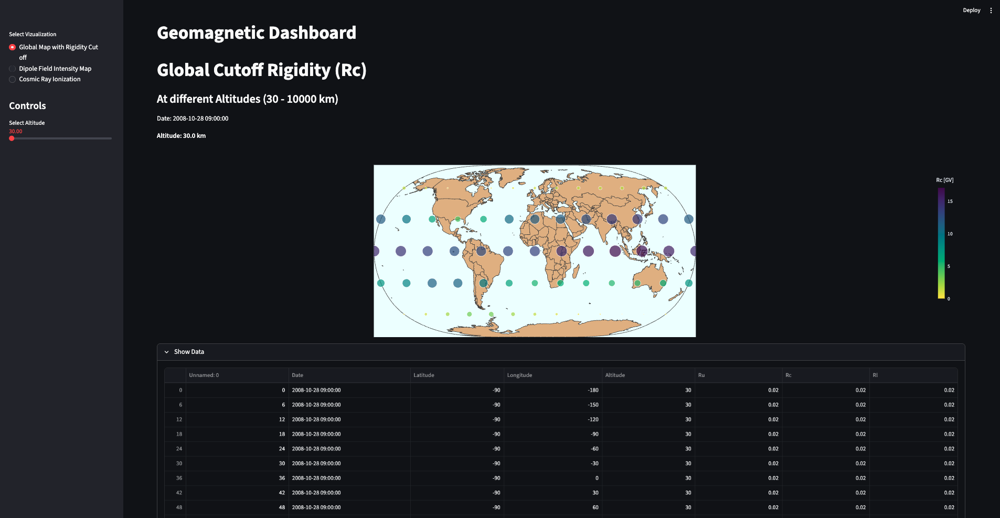
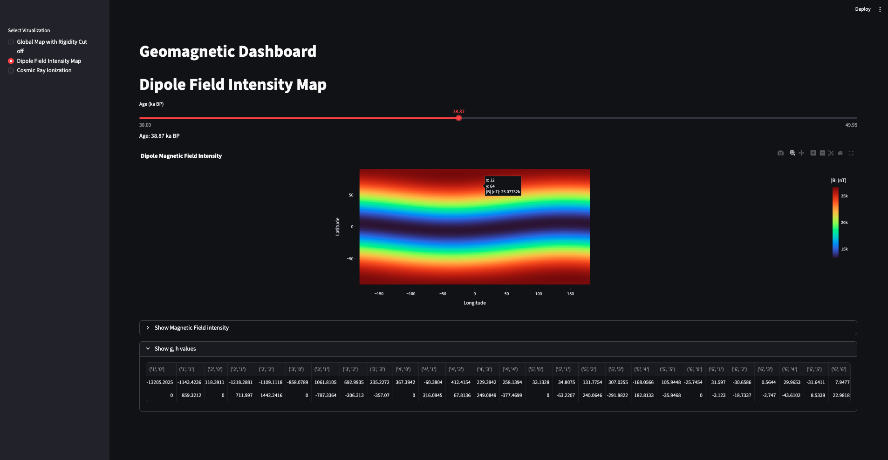
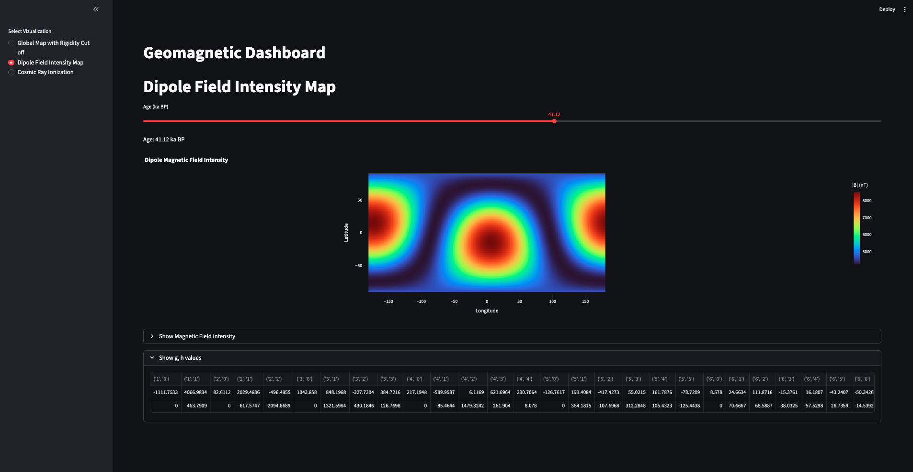
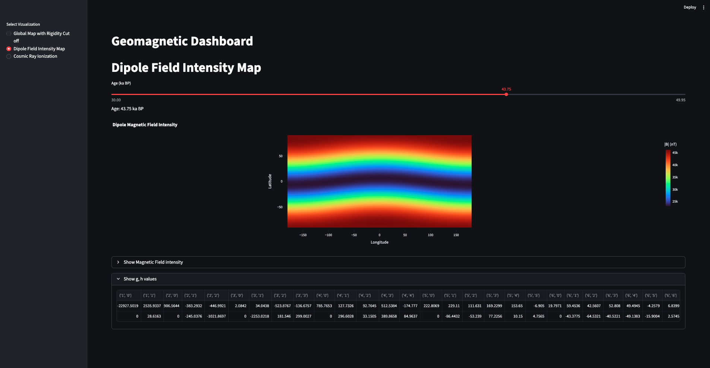
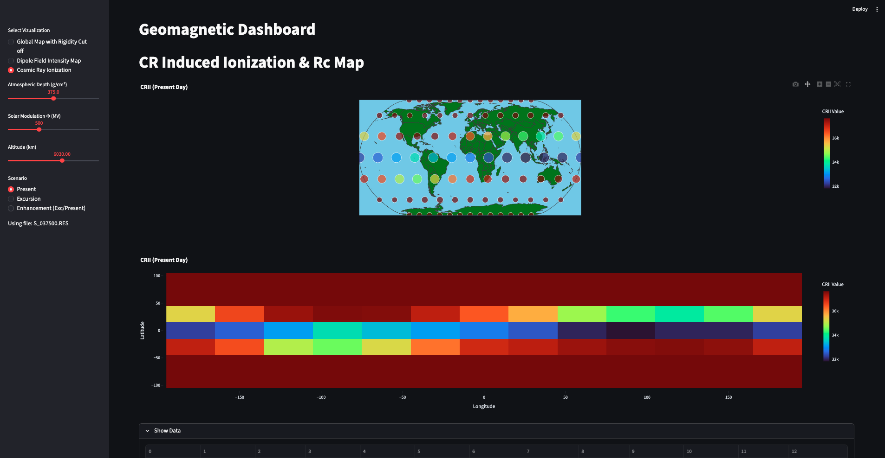
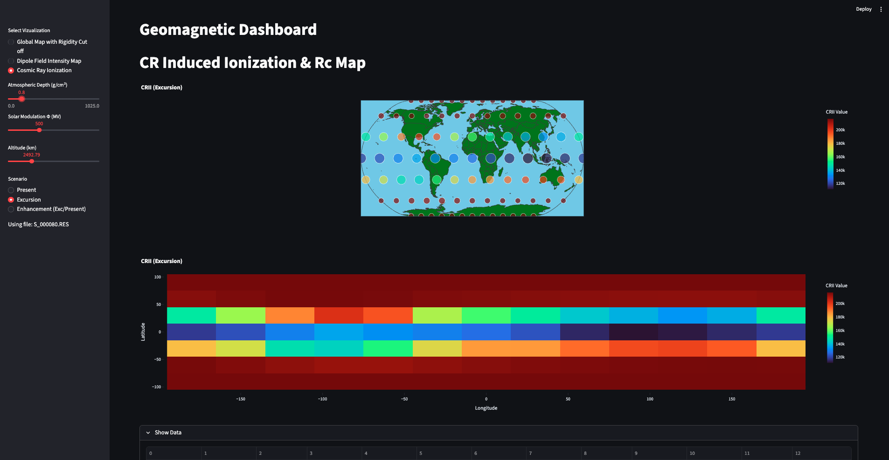
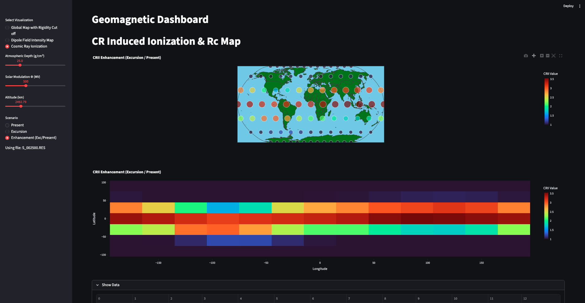

## Glimpses of the Geomagnetic Dashboard On Streamlit

## Run the Streamlit Geomagnetic Dashboard

```bash
pip3 install -r requirements.txt

cd app

streamlit run main.py
```

### 1. Global Map showing the Rigidity Cutoff in a Latitude-Longitude Grid

- Can be varied based on the **Altitude**
- Shows the (Rc, lat, lon) values on hovering



### 2. Magnetic Dipole Field Instensity Map through the Ages

- Choose the age on the slider and the magnetic field intensity is mapped as a function of (lat, lon)
- Obtains the (g, h) coefficients using the fortran program ls_coeff to compute the $B$-value for each (lat, lon) pair at a given age. [lscoefs.py](src/lscoefs.py)
- Used the LSMOD.2 model for obtaining spherical harmonics coefficients [[4]](#4-korte-monika-brown-maxwell-2019-lsmod2---global-paleomagnetic-field-model-for-50----30-ka-bp-v-2-gfz-data-services-httpsdoiorg105880gfz232019001)

    #### 1. Pre-Laschamps Period

    

    #### 2. Laschamps Excursion

    

    #### 3. Post-Laschamps Period

    


### 3. Cosmic Ray Induced Ionization Rates (Dose Rates)

- Based on the atmospheric depth $(g/cm^2)$, solar modulation $(\phi)$, and altitude, the $R_c$ and CRII values are obtained from OTSO model [[3]](#3-larsen-n-mishev-a--usoskin-i-2023-jgr-space-physics-128-e2022ja031061-httpsdoiorg1010292022ja031061) and CRAC-CRII_v3 [[1]](#1-ig-usoskin-ga-kovaltsov-and-al-mishev-j-space-weather-space-clim-14-2024-20-doi-httpsdoiorg101051swsc2024020) models respectively


    #### 1. Present CRII

    

    #### 2. Excursion Scenario

    

    #### 3. Comparative CRII ($Q_{present}/Q_{exc}$)

    

### *Citations*

#### [1] I.G. Usoskin, G.A. Kovaltsov and A.L. Mishev. J. Space Weather Space Clim., 14 (2024) 20 DOI: [https://doi.org/10.1051/swsc/2024020](https://doi.org/10.1051/swsc/2024020)

#### [2] Usoskin, I. G., and G. A.Kovaltsov (2006), Cosmic ray induced ionization in the atmosphere: Full modeling and practical applications, J. Geophys. Res., 111, D21206, [https://doi:10.1029/2006JD007150](https://doi:10.1029/2006JD007150).

#### [3] Larsen, N., Mishev, A., & Usoskin, I. (2023). *JGR Space Physics*, 128, e2022JA031061. [https://doi.org/10.1029/2022JA031061](https://doi.org/10.1029/2022JA031061)

#### [4] Korte, Monika; Brown, Maxwell (2019): LSMOD.2 - Global paleomagnetic field model for 50 -- 30 ka BP. V. 2. GFZ Data Services. https://doi.org/10.5880/GFZ.2.3.2019.001