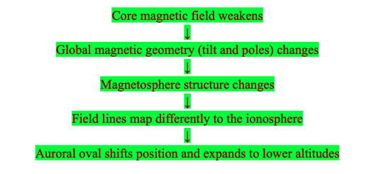
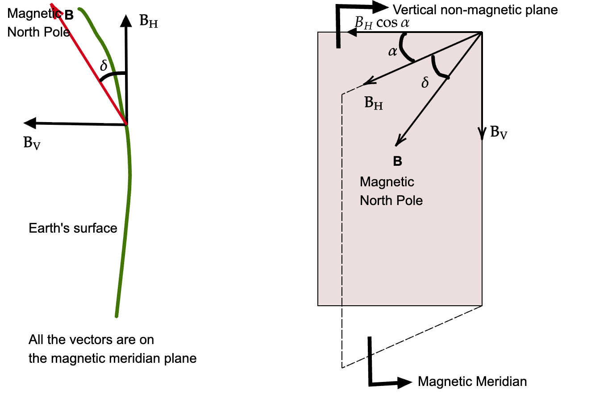
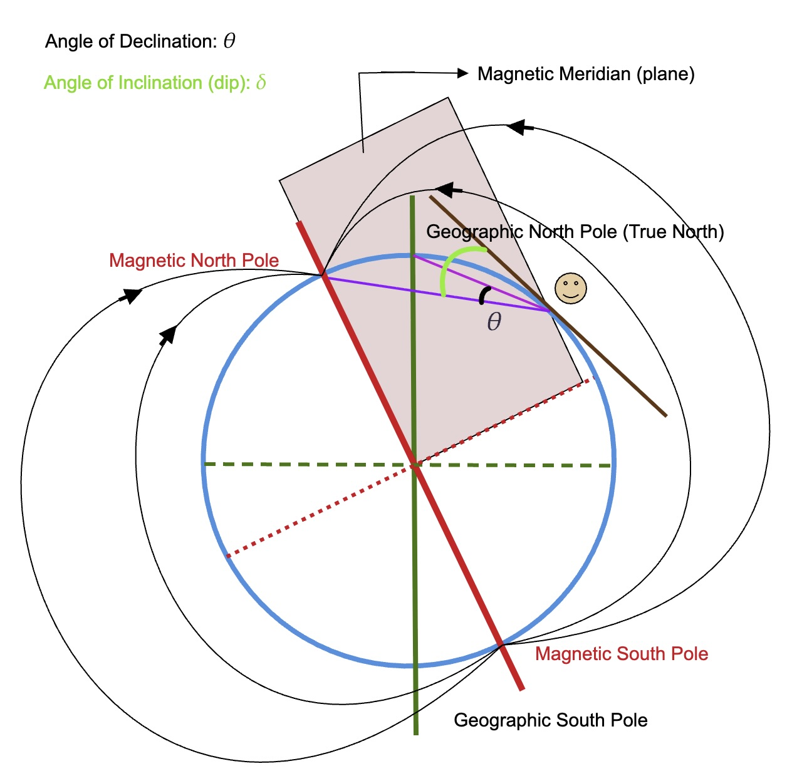
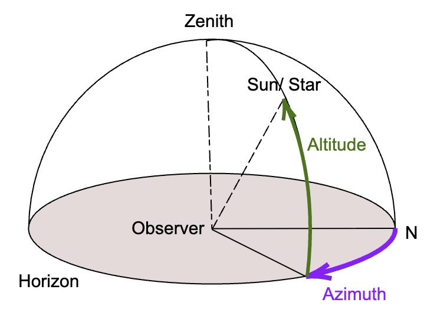
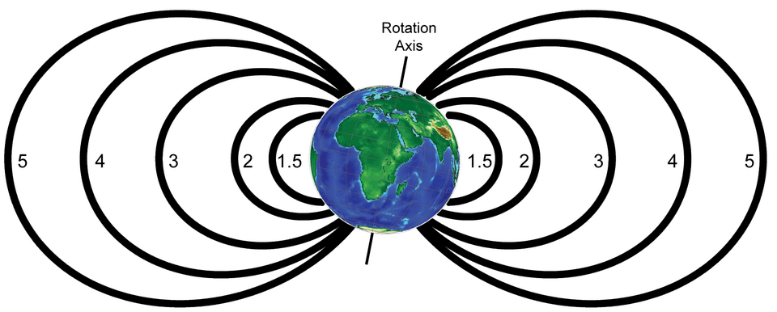

# Geomagnetic Field Modeling and Atmospheric CR Induced Ionization Analysis through Ages
This project computes the global geomagnetic rigidity cutoffs using a real paleomagnetic field model and computes atmospheric ionization and effective dose rates to compare present-day vs excursion scenarios, over latitude and altitude

## Objective
1. Compute global geomagnetic rigidity cutoffs using a real paleomagnetic field model (e.g., LSMOD.2)

2. Use a CRAC-style model to compute atmospheric ionization and effective dose rates

3. Compare present-day vs. excursion scenarios, over latitude and altitude

4. Assess implications for aviation and atmospheric processes

5. Visualize atmospheric ion production and dose rate changes with magnetic field weakening


## Run this command in terminal before the notebook executions

```bash
# change to the working directory of the project
cd path/to/the project

# create a virtual python enviroment
python3 -m venv .venv

# Activate the environment
source venv/bin/activate # for MacOS/Bash/zsh/Linux

myenv\Scripts\activate.bat # for Windows Command Prompt

.\myenv\Scripts\Activate.ps1 # for Windows Powershell

# install the requirements
pip3 install -r requirements.txt
```

## Run the Streamlit Geomagnetic Dashboard

(After installing the requirements)

```bash
cd app

streamlit run main.py
```

> ### Streamlit Dashboard: [Dashboard](Dashboard.md)

> ### Use the [Setup for Fortran Wrap](installation_in_bash.txt) for complete setup

# Literature Review

According to [[1]](#1-mukhopadhyay-a-panovska-s-garvey-r-liemohn-m-w-ganjushkina-n-brenner-a-usoskin-i-balikhin-m--welling-d-t-2025-science-advances-1116-eadq7275--httpsdoiorg101126sciadvadq7275), during the Laschamps geomagnetic excursion period (about 41 ka ago), the Earth’s magnetic field reduced to ~10% of the modern values, and the magnetic poles underwent dramatic tilts away from the geographic poles. The Earth’s dipole behaviour was lost as it exhibited multipolarity, similar to the outer planets. The weakened dipole strengths and tilts in the magnetic poles resulted in changes in auroral regions and open magnetic lines, extending to equatorial regions (lower latitudes).

The paper reproduced geomagnetic behavior in:

### Pre-Laschamps Period (50–43 ka)
- Strong axial dipole
- High dipole moment values
- Similar to present-day field

### During Laschamps (42–40 ka)
- Dipole weakened nearly to zero
- Brief polarity reversals
- Global directional changes
- Non-dipole components similar to pre-Laschamps

### Post-Laschamps (39–30 ka)
- Gradual dipole recovery
- Intermittent regional excursions
- Eventual return toward modern intensity


## Event Mapping During the Laschamps Excursion




##### What happens if such an excursion happens in the modern world where daily life depends enormously on space climate? 

According to [[2]](#2-larsen-n-usoskin-i-mishev-a-koldobskiy-s--väisänen-p-2026-journal-of-geophysical-research-space-physics-131-e2025ja034820--httpsdoiorg1010292025ja034820), the cosmic rays penetrating through the earth’s atmosphere increases, which could result in phenomena like, cosmogenic isotope production [[3]](#3-poluianov-s-v-g-akovaltsov-a-lmishev-and-i-gusoskin-2016-jgr-atmospheres-121-81258136--httpsdoiorg1010022016jd025034) and atmospheric ionization and radiation.

# Knowledge Summary

## 1. Dipole Magnetic Field

An electric dipole is defined as two equal and opposite charged particles separated by a small and fixed distance. A magnetic dipole is a pair of equal and opposite magnetic poles separated by a small distance, or a closed loop of electric current creating a magnetic field.

The Earth’s magnetic field (MF) is characterised as a magnetic dipole acting like a giant bar magnet placed approximately 11° tilted to the rotational axis. The source of the MF is the rotating liquid core of the Earth, which generates electric currents.

### Magnetic Declination ($\theta$)

The angle between the magnetic north pole and the geographic north pole at the Earth's surface.

### Magnetic Inclination ($\delta$)

The angle formed between the magnetic field vector and the horizontal plane along the magnetic meridian.

$$
\tan \delta = \frac{B_v}{B_h}
$$

Where:

- $B_v$ = vertical component of magnetic field  
- $B_h$ = horizontal component of magnetic field  

### Apparent Dip $(\delta')$

The apparent angle of inclination formed by a non-magnetic meridian plane at an angle with the magnetic meridian plane.

$$
\delta' = \tan^{-1}(\frac{\tan\delta}{\cos\alpha})
$$





### Zenith and Azimuth Angles [[8]](#8-solar-azimuth-angle-httpsenwikipediaorgwikisolar_azimuth_angle)

**Zenith Angle**: It is the vertical angle between the sun and the observer on the Earth. 

$Z=0^\circ$, when sun is overhead, and $Z =90^\circ$, when sun is at the horizon.

**Azimuth angle**: It is the horizontal angle between the sun measured from the true north along the horizon.

$$
\cos\phi_s = \frac{\sin\delta\cos\Phi-\cos h \cos\delta\sin\Phi}{\sin\theta_s}
$$

where, $\phi_s$: solar azimuth angle,

$\theta_s$: solar zenith angle,

$h$: hour angle in the local solar time (0 for noon, negative for morning, and positive for afternoon. Changes at $15^\circ$ per hour)

$\delta$: Angle of solar Declination

$\Phi$: local latitude

During an equinox,
- At Sunrise: $A = 90^\circ$, i.e., east
- At Noon (in northern hemisphere): $A = 180^\circ$, i.e, south-facing
- During Sunset: $A = 270^\circ$, i.e., west



---

## 2. Magnetic Field ($\mathbf{B}$) of Dipole Moment ($\mathbf{m}$)

The magnetic field experienced at position $\mathbf{r}$ due to dipole moment $\mathbf{m}$ is:

$$
\mathbf{B}(\mathbf{r}) =\frac{\mu_0}{4\pi r^3}\left[3(\mathbf{m} \cdot \hat{r})\hat{r}-\mathbf{m}\right]
$$

### In Spherical Coordinates (Aligned Dipole)

Radial component:

$$
B_r = -\frac{2M \cos\theta}{r^3}
$$

Latitudinal component:

$$
B_\theta = -\frac{M \sin\theta}{r^3}
$$

Where:

- $r$ = radial distance from Earth’s center  
- $\theta$ = colatitude measured from magnetic north pole  
- $M$ = dipole moment  

Magnetic latitude: $\lambda = 90^\circ - \theta$

---

## 3. L-shell (L-value or McIlwain L-parameter)

An L-shell labels a dipole magnetic field line. It gives the radial distance (in Earth radii) at which the dipole field line passes through the magnetic equator.

$$
L = \frac{r}{R_E}
$$

Where:

- $r$ = radial distance at equator  
- $R_E$ = Earth’s radius  

In a centered dipole magnetic field model, the field line equation is:

$$
r = L R_E \cos^2 \lambda
$$

Where:

- $\lambda$ = magnetic latitude  

### L-Shell Illustration



Image Source: [Wikipedia](https://en.wikipedia.org/wiki/File:L_shell_global_dipole.png)

Field line interpretations:

- $L = 1–2$ → Inner radiation belt / Ionosphere  
- $L = 4–6$ → Outer radiation belt  
- $L \approx 4–5$ → Plasmapause  
- $L \approx 6–7$ → Auroral Zone  

---

## Plasmasphere

The region of ionospheric plasma which corotates with the Earth along magnetic field lines. The plasma is colder (lower average ion energy) than in the outer magnetosphere.

## Plasmapause

Outer boundary of plasmasphere marking a significant drop in cold plasma density.

## Magnetopause

Boundary separating solar wind plasma from Earth’s magnetosphere.

---

## Cosmogenic Radioisotope Formation [[3]](#3-poluianov-s-v-g-akovaltsov-a-lmishev-and-i-gusoskin-2016-jgr-atmospheres-121-81258136--httpsdoiorg1010022016jd025034)

Radioactive and stable isotopes such as:

- $^7Be$
- $^{10}Be$
- $^{14}C$
- $^{22}Na$
- $^{36}Cl$

are formed when cosmic rays bombard atmospheric gases (N, O, Ar).

Production depends on:

- Solar activity  
- Earth’s magnetic field strength  

---

## Geomagnetic Cut-off Rigidity

Defined as the minimum momentum per unit charge required for a charged particle (e.g., cosmic rays) to penetrate the magnetosphere at a given latitude, longitude, and angle. It is the measure of the Earth’s magnetic shielding.

Units: Gigavolts (GV)

### Störmer Cut-off Rigidity [[5]](#5-kress-b-t-m-khudson-r-sselesnick-c-jmertens-and-mengel-2015-jgr-space-physics-120-56945702-httpsdoiorg1010022014ja020899)

$$
R_c =\frac{M}{r^2}\frac{\cos^4 \lambda}{\left(1 + \sqrt{1 - \cos^3\lambda \sin Z \sin A}\right)^2}
$$

Where,

$\lambda$ : magnetic latitude

R: the distance from center of the dipole (in earth radii, RE)

Z: Zenith angle measured from the vertical direction

A: Azimuth angle measured clockwise from the north


From the Störmer cut-off rigidity, we can infer the following –

1. At pole,$\lambda= 90^\circ$, and the rigidity is minimum, i.e., charged particles are penetrated easily. 

2. However, at magnetic equator, $\lambda = 0$, the rigidity is the highest.

3. For charged particles moving vertically, 

$$
A = Z = 0
\implies R_{CV}= \frac{M\cos^4\lambda}{4 R^2}
$$


---

## What is Paleomagnetic field?
A paleomagnetic field is the ancient magentic field of the Earth preserved in rocks, sediment, or archeological materials at the time they formed. There are mainly two ways in which this data is stored in materials.
1. `Thermoremanent magnetization`: When material containing magentic material are heated above the Curie temperature, the magnetic monet of the particles at atomic level aligns with the geomagnetic field. Upon cooling, these magnetic moments are preserved in oriented samples of such materials, with information about the field intensity and direction. E.g.: ceramics, bricks, volcanic lava flows
2. `Depositional remanence`: In sediments or speleothems, the magentic particles get oriented along the ambient geomagentic field during deposition and stays in that position when further materials gathers and solidies. However, this technique only provides the variation in field intensity, therefore, requires additional dating processes to quantify the field informtaion to the past date. [[6]](#6-monika-korte-sanja-panovska-maximilian-a-schanner-ahmed-n-mahgoub-martin-rother-2025-journal-of-geological-society-of-india-1016-890895--httpsdoiorg1017491jgsi2025174179)

---

## Paleomagnetic Field Models

Used to reconstruct Earth’s past magnetic field using rocks, sediments, and archaeological data.

LSMOD.2 is used for studying geomagnetism in the 70–15 ka interval [[6]](#6-monika-korte-sanja-panovska-maximilian-a-schanner-ahmed-n-mahgoub-martin-rother-2025-journal-of-geological-society-of-india-1016-890895--httpsdoiorg1017491jgsi2025174179) 

Data used: LSMOD.2 - Global paleomagnetic field model for 50 - 30 ka BP[[7]](#7-korte-monika-brown-maxwell-2019-lsmod2---global-paleomagnetic-field-model-for-50----30-ka-bp-v-2-gfz-data-services-httpsdoiorg105880gfz232019001).

---

## OTSO [[4]](#4-larsen-n-mishev-a--usoskin-i-2023-jgr-space-physics-128-e2022ja031061--httpsdoiorg1010292022ja031061)

“Oulu – Open-source geomagneToSphere prOpagation” tool.

Used for:

- Cosmic ray trajectory tracing  
- Rigidity cutoff calculations  
- Geomagnetic shielding studies  


## Atmospheric Radiation Dose Rate

The amount of ionizing radiation energy deposited in an area per unit time. It is the sum of cosmic radiation, terrestrial radiation, and artificial radiation.

Units:

- nanoSieverts per hour (nSv/hr)
- microGrays per hour (µGy/hr)

Depends on:

- Latitude  
- Altitude  
- Geomagnetic conditions  
- Solar activity  


# Project Objectives

1. Compute global geomagnetic rigidity cutoffs using LSMOD.2  
2. Use CRAC-style model to compute atmospheric ionization and effective dose rates  
3. Compare present-day vs. excursion scenarios over latitude and altitude  
4. Assess implications for aviation and atmospheric processes  
5. Visualize atmospheric ion production and dose rate changes with magnetic field weakening  

---

# What is an Auroral Oval?

The auroral oval is a ring-shaped region around geomagnetic poles where charged particles precipitate into the upper atmosphere, producing aurora. During geomagnetic weakening events such as the Laschamps excursion, the auroral oval shifts and expands toward lower latitudes.

---

# Citations

#### [1] Mukhopadhyay, A., Panovska, S., Garvey, R., Liemohn, M. W., Ganjushkina, N., Brenner, A., Usoskin, I., Balikhin, M., & Welling, D. T. (2025). *Science Advances*, 11(16), eadq7275.  https://doi.org/10.1126/sciadv.adq7275

#### [2] Larsen, N., Usoskin, I., Mishev, A., Koldobskiy, S., & Väisänen, P. (2026). *Journal of Geophysical Research: Space Physics*, 131, e2025JA034820.  https://doi.org/10.1029/2025JA034820  

#### [3] Poluianov, S. V., G. A.Kovaltsov, A. L.Mishev, and I. G.Usoskin (2016). *JGR Atmospheres*, 121, 8125–8136.  https://doi.org/10.1002/2016JD025034  

#### [4] Larsen, N., Mishev, A., & Usoskin, I. (2023). *JGR Space Physics*, 128, e2022JA031061.  https://doi.org/10.1029/2022JA031061  

#### [5] Kress, B. T., M. K.Hudson, R. S.Selesnick, C. J.Mertens, and M.Engel (2015). *JGR Space Physics*, 120, 5694–5702. https://doi.org/10.1002/2014JA020899  

#### [6] Monika Korte, Sanja Panovska, Maximilian A. Schanner, Ahmed N. Mahgoub, Martin Rother (2025). *Journal of Geological Society of India*, 101(6), 890–895.  https://doi.org/10.17491/jgsi/2025/174179

#### [7] Korte, Monika; Brown, Maxwell (2019): LSMOD.2 - Global paleomagnetic field model for 50 -- 30 ka BP. V. 2. GFZ Data Services. https://doi.org/10.5880/GFZ.2.3.2019.001

#### [8] Solar Azimuth Angle https://en.wikipedia.org/wiki/Solar_azimuth_angle